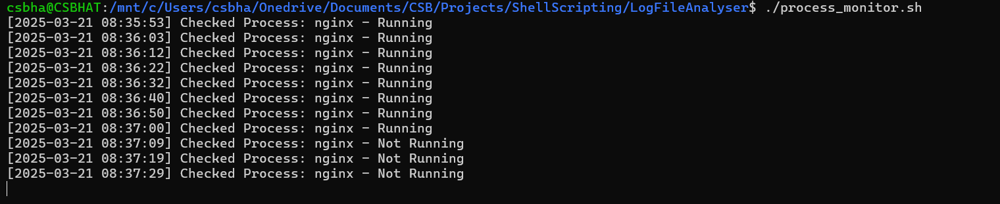

# Process Monitoring Script

This Bash script monitors a specified system process (default: nginx) and logs its status (Running or Not Running) to a log file (process_monitor.log) every 10 seconds. The script runs in an infinite loop and writes timestamped status updates to the log. If the process is not running, it updates the log and continues to check the process at regular intervals.

Features:
Monitors a specified process (nginx by default).
Logs process status (Running/Not Running) with timestamps.
Runs continuously and logs every 10 seconds.
Can be easily customized to monitor other processes.

Usage:
Ensure the script is executable:

chmod +x process_monitor.sh

Run the script:

./process_monitor.sh

The script will log the process status in real-time to process_monitor.log.

## Log Results Screenshot

